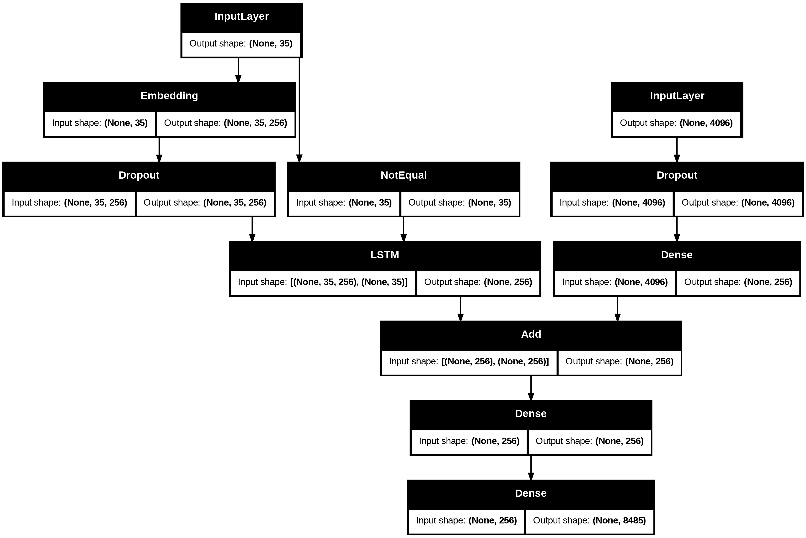
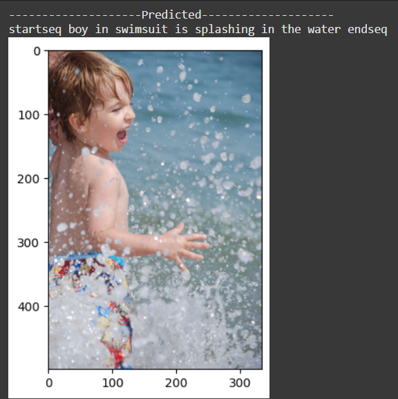
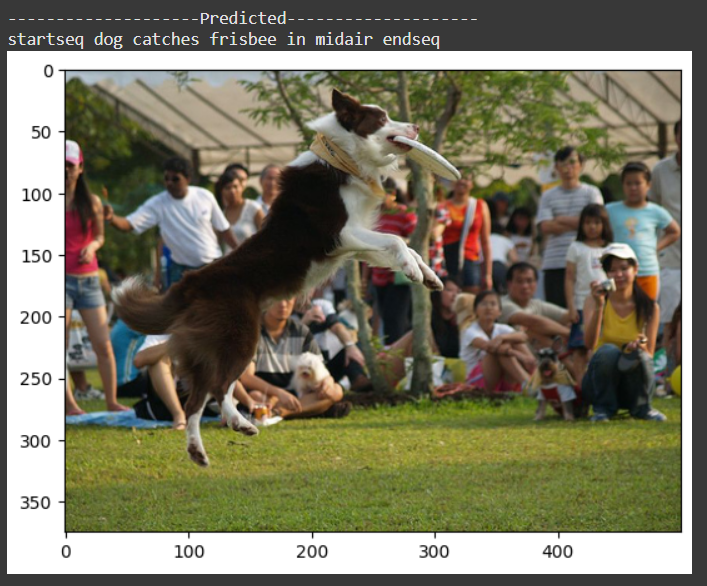

# 🖼️ Image Caption Generator

An **Image Caption Generator** built using **Deep Learning** that combines **Convolutional Neural Networks (CNNs)** for image feature extraction and **Long Short-Term Memory (LSTM)** networks for generating natural language captions.

---

## 📊 Dataset
We use the **[Flickr8k Dataset](https://www.kaggle.com/datasets/adityajn105/flickr8k)**, which contains:
- 8,000 images
- Each image annotated with 5 different captions
- Diverse real-world objects, scenes, and actions

---

## 🧠 Model Architecture

The model integrates **two inputs**:
1. **Image Features** extracted using a pre-trained CNN (VGG16).
2. **Text Sequences** processed using Embedding + LSTM.

These two streams are merged and passed through Dense layers to generate the next word in the caption.

### Architecture Diagram


**Key Layers:**
- **CNN Feature Extractor**: VGG16, output size 4096 → Dense(256)
- **Text Encoder**: Embedding (256) + LSTM(256)
- **Fusion**: Add([CNN, LSTM])
- **Decoder**: Dense layers → Vocabulary output (8,485 words)

---

## 📂 Project Structure
image-caption-generator/

│── captiongenerator.ipynb  #main notebook

│── requirements.txt  #dependencies

│── README.md  #project documentation

│── model.png  #model architecture diagram

│── data/  #pretrained model

---

## ⚙️ Installation
Clone this repository and install dependencies:

```bash
git clone https://github.com/your-username/image-caption-generator.git
cd image-caption-generator
pip install -r requirements.txt
```
---

## ▶️ Usage
You can **train the model from scratch**.
### Run Full Training
Run the notebook:
```bash
jupyter notebook captiongenerator.ipynb
```
**Steps inside the notebook:**
1. Load and preprocess dataset captions.
2. Extract image features using VGG16.
3. Tokenize and encode text sequences.
4. Train CNN + LSTM model.
5. Generate captions for new images.

---

## 📸 Example Output

Here are some example captions generated by the model:
### Example 1

### Example 2


